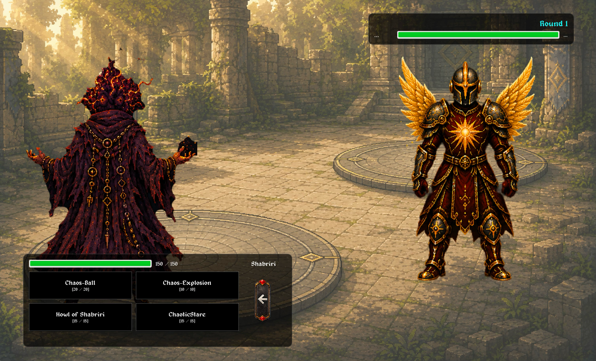

# Neural Network & Reinforcement Learning Framework

A from-scratch neural network and Deep Q-Network (DQN) implementation in Java 21, with no external runtime dependencies. Applied to a turn-based combat environment as the training target.

## Background

This repository is an isolated extraction of the ML/AI subsystem from a Java-based online Pokémon-style 2D battle game. The goal is to train an AI opponent using reinforcement learning: two agents, both driven by the same network, compete against each other in self-play and learn the game from experience.

## Project Structure

### `nn.math` — Linear Algebra & ML Primitives

Matrix operations and the full suite of activation/loss/initializer primitives used throughout the framework.

**Activation functions:** `ReLU`, `LeakyReLU`, `Sigmoid`, `Tanh`, `Softmax`, `Linear`

**Loss functions:** `MSE`, `Huber`, `BinaryCrossEntropy`, `CategoricalCrossEntropy`, `FocalLoss`, `SoftmaxCCE`

**Weight initializers:** `HeNormal`, `HeUniform`, `XavierNormal`, `XavierUniform` — selected automatically per layer based on activation function

> The math package is also used in [gpt-from-scratch-java](https://github.com/jonaebel/gpt-from-scratch-java), slightly adapted as a standalone Java ML math library.

---

### `nn.core` — Network Architecture

- **`NeuronalNetwork`** — configurable depth and width, forward pass and backpropagation
- **`Layer`** — dense layer; all computations are matrix-based at the core
- **`Neuron`** — single-neuron reference implementation (used early in development; superseded by `Layer` for performance)
- **`ReplayBuffer`** — circular experience replay buffer with uniform random sampling

---

### `nn.rl` — Reinforcement Learning Environment

A compact turn-based 1v1 combat simulator used as the RL training environment (a really simplified version of the game the network was originally built for).

| Class | Role |
|---|---|
| `Fighter` / `FighterClass` | 5 archetypes: Striker, Tank, Speedster, Mage, Balanced |
| `Action` | Typed attacks with limited uses per battle |
| `ElementType` | 8 elements with a type-advantage chart |
| `Condition` | Status effects tracked per fighter |
| `Combat` | Damage formula with stat stages and type multipliers |
| `StateEncoder` | Encodes full combat state as a normalised 101-feature vector |
| `Gym` | DQN training loop — epsilon-greedy exploration, target network, self-play |

## Network Architecture

```
Input (101 features)
  ↓
[Dense 256, LeakyReLU]
  ↓
[Dense 128, LeakyReLU]
  ↓
[Dense 6, Linear]
  ↓
Q-values for 6 actions (attack ×4, switch ×2)
```

### State Encoding (101 features, team size = 3)

| Feature group | Count |
|---|---|
| Per fighter: HP, attack, defense, speed + 8-element type one-hot (×6 fighters) | 72 |
| Team alive ratio (own + enemy) | 2 |
| Active fighter conditions (×2) | 12 |
| Active fighter stat stages (×2) | 6 |
| Type effectiveness (attacker → defender, both directions) | 2 |
| Speed ratio | 1 |
| Best-move damage estimate (both directions) | 2 |
| Action uses remaining | 4 |
| **Total** | **101** |

## Training

Two-phase training, 5 000 episodes each:

1. **Phase 1 — vs Random:** Agent A learns; Agent B acts randomly (`ε = 1.0`). Lets A discover basic combat strategy without a moving target.
2. **Phase 2 — Self-Play:** Both agents learn against each other, sharing the same network architecture.

**DQN components:**
- Double DQN: separate online and target networks, synced every `sync_every` episodes
- Huber loss for stable Q-value regression
- Epsilon-greedy exploration with exponential decay: `1.0 → 0.05` (`decay = 0.995`)
- Experience replay via `ReplayBuffer`

**Reward signal** (per turn): damage dealt to enemy team HP, fighters knocked out on each side, and a ±5 terminal bonus for win/loss.

## Running

```bash
mvn compile exec:java
```

This runs `StateEncoder.main()`, which sets up both agents and the gym and starts the two-phase training loop. You can also run `StateEncoder.main()` directly from your IDE.

## Requirements

- Java 21
- Maven 3.x
- No external runtime dependencies (JUnit 5 for tests only)

---

## The Game

This framework was built for a Java-based online 2D battle game currently in early development. The screenshot below gives a feel for what we're working toward.

<p align="center">
  
</p>

We are a team of four. The ML and math subsystems were designed and implemented by [Peer Grunow](https://github.com/PeerGrunow) and [Jonathan Ebel](https://github.com/jonaebel).
The other two in our Development team for the game are Christoph Schindler and Elwin Schwabenland
